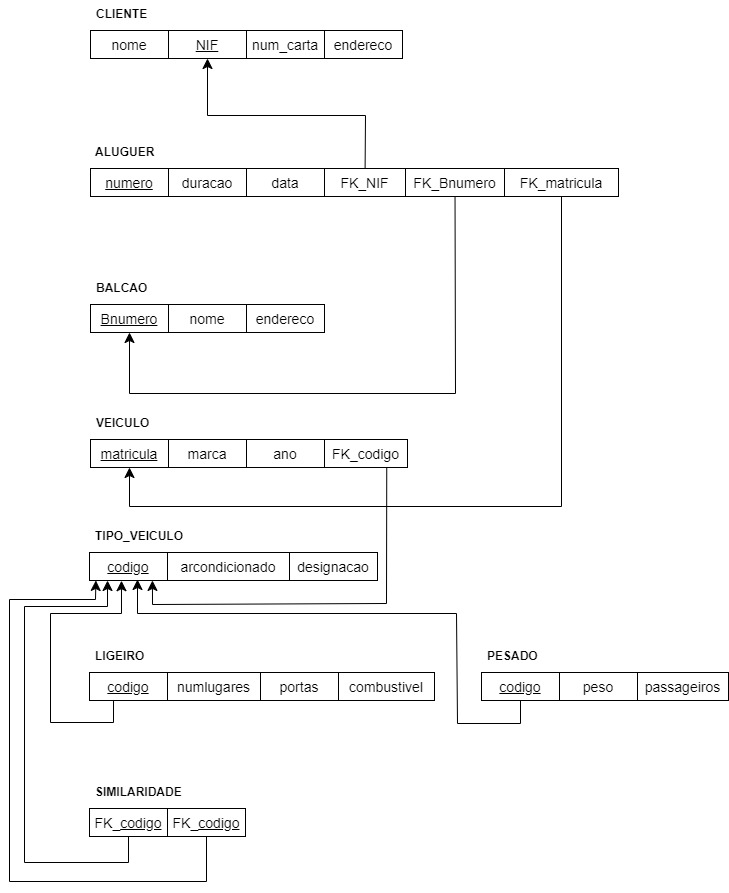
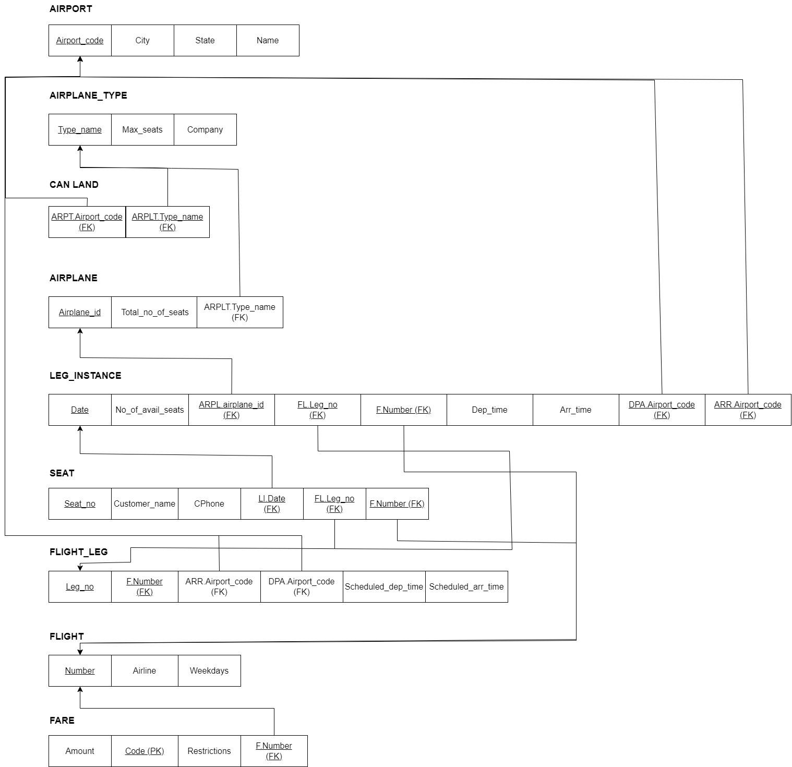
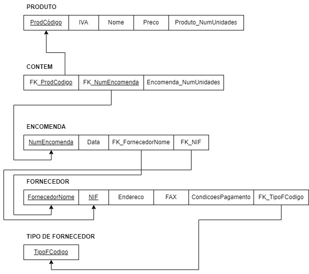
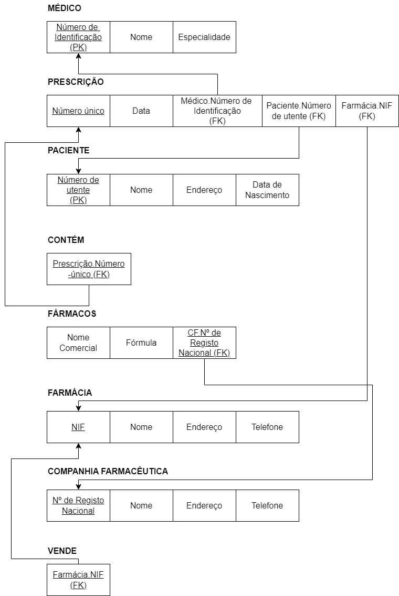
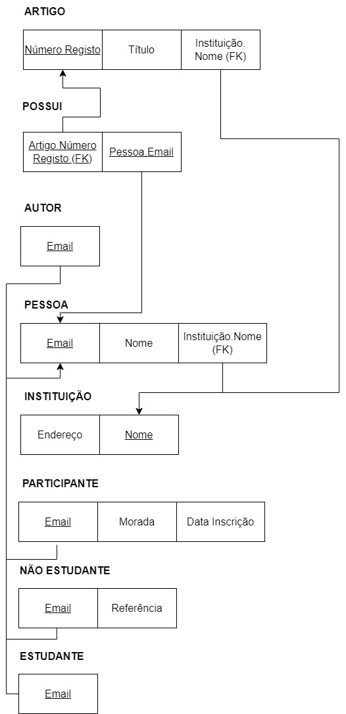
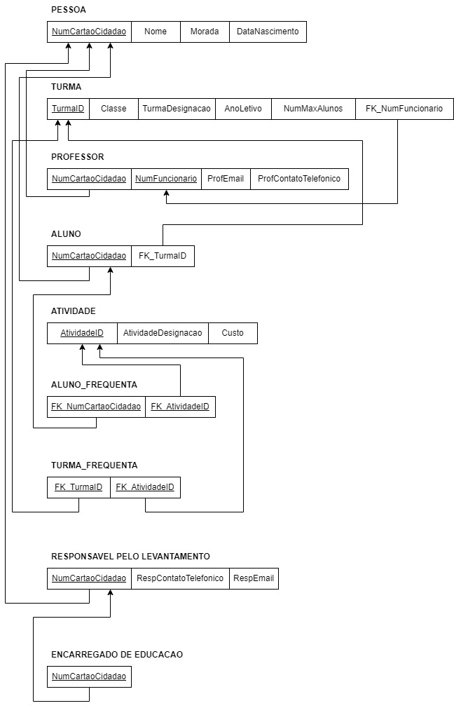

# BD: Guião 3


## ​Problema 3.1
 
### *a)*

```
CLIENTE(nome, NIF, num_carta, endereco)
ALUGUER(numero, durecao, data, FK_NIF, FK_Bnumero, FK_matricula)
BALCAO(Bnumero, nome, endereco)
VEICULO(matricula, marca, ano, FK_codigo)
TIPO_VEICULO(codigo, arcondicionado, designacao)
LIGEIRO(codigo, numlugares, portas, combustivel)
PESADO(codigo, peso, passageiros)
SIMILARIDADE(FK_codigo1, FK_codigo2)

```


### *b)* 

```
Chaves candidatas:
    CLIENTE: NIF, num_carta
    ALUGUER: numero
    BALCAO: Bnumero
    VEICULO: matricula
    TIPO_VEICULO: codigo


Chaves primarias:
    CLIENTE: NIF
    ALUGUER: numero
    BALCAO: Bnumero
    VEICULO: matricula
    TIPO_VEICULO: codigo
    LIGEIRO: codigo
    PESADO: codigo


Chaves estrangeiras:
    ALUGUER: FK_NIF, FK_Bnumero, FK_matricula
    VEICULO: FK_codigo
    SIMILARIDADE: FK_codigo

```


### *c)* 




## ​Problema 3.2

### *a)*

```
Relação:
	Vários tipos de aviões podem aterrar em diferentes aeroportos (identificado pelo código). Em cada aeroporto podem estar atribuídas chegadas e partidas derivadas das flight_leg. Por sua vez cada avião está associado a um tipo de avião. Um avião (identificado pelo seu id) pode ter várias leg_instance, com diversos seats cada, atribuídas. A mesma é uma instância de flight_leg e sendo que uma flight_leg têm associadas uma ou mais leg_instance, por outro lado flight_legs só podem estar associadas a um voo. Cada voo possui pode ter várias flight_leg e o número do mesmo serve para o identificar. Cada voo pode possuir várias fare e cada fare está associada a apenas um voo.
Esquema Relação:
AIRPORT(Airport_code, City, State, Name)
AIRPLANE_TYPE(Company, Type_name, Max_seats)
CAN_LAND(ARPT.Airport_code, ARPLT.Type_name)
AIRPLANE(Airplane_id, Total_no_of_seats, ARPLT.Type_name)
LEG_INSTANCE(Date, No_of_avail_seats, ARPL.airplane_id, FL.Leg_no, F.Number, Dep_time, Arr_time, DPA.Airport_code, ARR.Airport_code)
SEAT(Seat_no, Customer_name, Cphone, LI.Date)
FLIGHT_LEG(Leg_no, F.Number, ARR.Airport_code, DPA.Airport_code, Scheduled_dep_time. Scheduled_arr_time)
FLIGHT(Number, Airline, Weekdays)
FARE(Amount, Code, Restrictions, F.Number)

```


### *b)* 

```
Chaves Candidatas:
-AIRPORT: Airport_code
-AIRPLANE_TYPE: Type_name
-AIRPLANE: Airplane_id
-LEG_INSTANCE: Date, ARPL.airplane_id, FL.leg_no, F.Number, ARPT.airport_code
-FLIGHT: Number
SEAT: Seat_no, LI.Date, FL.leg_no, F.Number
FLIGHT_LEG: Leg_no, F.Number
CAN_LAND: ARPT.Airport_code, ARPLT.Type_name
FARE: Code, F.Number

Chaves Primárias:
-AIRPORT: Airport_code
-AIRPLANE_TYPE: Type_name
-AIRPLANE: Airplane_id
-LEG_INSTANCE: Date, ARPL.airplane_id, FL.leg_no, F.Number, ARPT.airport_code
-FLIGHT: Number
SEAT: Seat_no, LI.Date, FL.leg_no, F.Number
FLIGHT_LEG: Leg_no, F.Number
CAN_LAND: ARPT.Airport_code, ARPLT.Type_name
FARE: Code, F.Number


Chaves Estrangeiras:
-AIRPLANE: ARPLT.Type_name
-LEG_INSTANCE: ARPL.Airplane_id, DPA.Airport_code, ARR.Airport_code, FL.Leg_no, F.Number.
SEAT: , LI.Date

```


### *c)* 




## ​Problema 3.3


### *a)* 2.1



### *b)* 2.2



### *c)* 2.3



### *d)* 2.4

