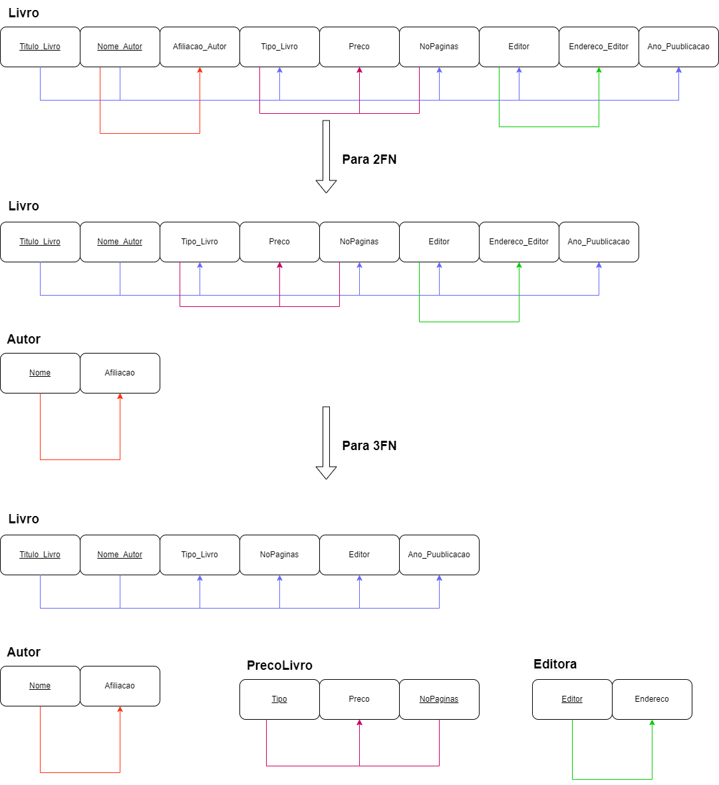
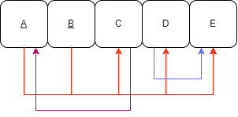

# BD: Guião 7


## ​7.2 
 
### *a)*

```
It is possible to <u>underline</u> -> {A, B,.. }
-> R1 (_A_, B, C)
-> R2 (B,F)


A relação está na primeira forma normal, pois cumpre todos os requisitos da mesma:
    - A mesma não contém atributos compostos ou multivalor, apenas atributos atómicos (simples e indivisíveis)
    - A mesma não contém Nested Relations, isto é, não contem relações contidas dentro de outras relações

Não esta na segunda forma pois contém dependencias parciais, isto é, alguns dos atributos não chave dependem exclusivamente de parte da chave primária. Caso o contrário se verifica-se estaria na 2FN.
    Exemplo:
        Nome_Autor -> Afiliacao_Autor
```

### *b)* 

```
1. Decompor a relação livro em 2FN:
    - Criar uma relação Autor(Nome, Afiliacao) e remover atributo Afiliacao_Autor da relação Livro
    
    Passa a existir duas relações Livro(Titulo_Livro, Nome_Autor, Tipo_Livro, Preco, NoPaginas, Editor, Endereco_Editor, Ano_Puublicacao) e Autor(Nome, Afiliacao) sem dependencias parciais e na 2FN.

2- Decompor a relação livro em 3FN:
    - Criar uma relação Editor(Editor, Endereco) e remover atributo Endereco_Editor da relação Livro
    - Criar uma relação PrecoLivro(Tipo, Preco, NoPaginas) e remover atributo Preco da relação Livro
    
    Passa a existir quatro relações Livro(Titulo_Livro, Nome_Autor, Tipo_Livro, Editor, Ano_Puublicacao), Autor(Nome, Afiliacao), Editor(Editor, Endereco) e PrecoLivro(Tipo, Preco, NoPaginas) sem dependencias transitivas e na 3FN.


```



## ​7.3
 
### *a)*

```
Chave primária -> {A,B}
```

### *b)* 

```
R = (_A_,D,E,I,J)
R1 = (_B_,F,G,H)
R2 = (_A_,_B_,C)
```


### *c)* 

```
R2 = (_A_,_B_,C)
R3 = (_A_,D,E)
R4 = (_D_,I,J)
R5 = (_B_,F)
R6 = (_F_,G,H)
```


## ​7.4
 
### *a)*

```
    Para determinar a chave de R, precisamos encontrar o conjunto mínimo de atributos que determinam todos os outros atributos na relação.

    Para tal, vamos analisar as dependências funcionais que existem na relação R. Sáo estas: F={ {A,B}→{C,D,E}, {D}→{ E}, {C}→{A}}.

    Sendo assim, podemos determinar a chave primária da relação R, que é o conjunto mínimo de atributos que determinam todos os outros atributos na relação. Após analisar as dependências funcionais, podemos concluir que a chave primária é {A,B}.

```



### *b)* 

```
... Write here your answer ...
1. Decompor a relação em 2FN:
    Já está na 2FN, pois não contém dependencias parciais.

2. Decompor a relação em 3FN:
    - Criar uma relação R2 (D, E) e remover atributo E da relação R
    - Criar uma relação R3 (C, A)
    Já está na 3FN, pois não contém dependencias transitivas.


Passamos a ter 3 relações R(A,B,C,D), R2(D,E) e R3(C,A)
```


### *c)* 

```
... Write here your answer ...

1. Decompor a relação em BCNF_:
    - Criar uma relação R2 (D, E) e remover atributo E da relação R
    - Criar uma relação R3 (C, A)
    Já está na BCNF, pois para todas as dependências funcionais, a parte esquerda da dependência é uma chave candidata.
```


## ​7.5
 
### *a)*

```
Chave primária -> {A,B}
```

### *b)* 

```
R1 = (_A_,_B_,C,D,E)
R2 = (_A_,C,D)
```


### *c)* 

```
R3 = (_A_,_B_,C,E)
R4 = (_C_,D)
R5 = (_A_,C)
```

### *d)* 

```
Já estava na forma BCNF logo:

R3 = (_A_,_B_,C,E)
R4 = (_C_,D)
R5 = (_A_,C)
```
